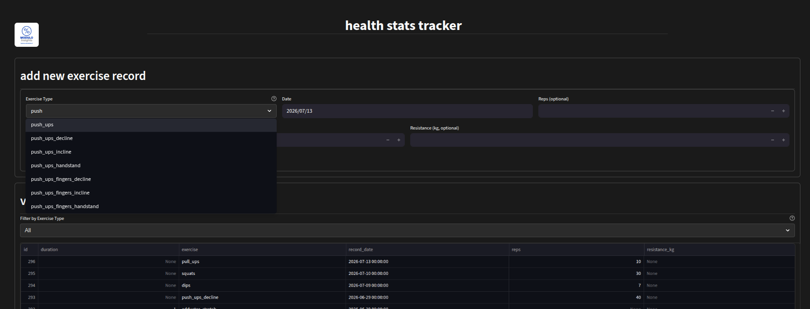
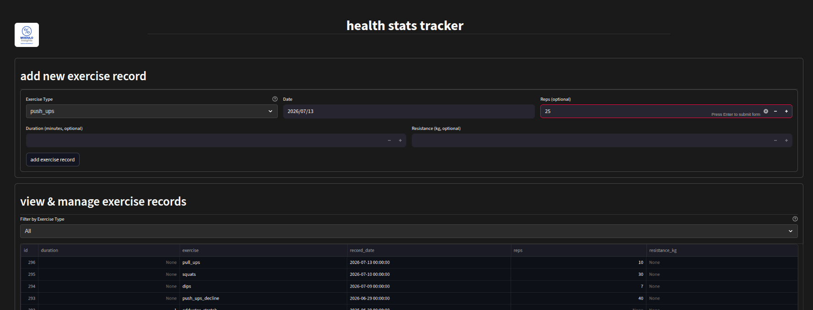
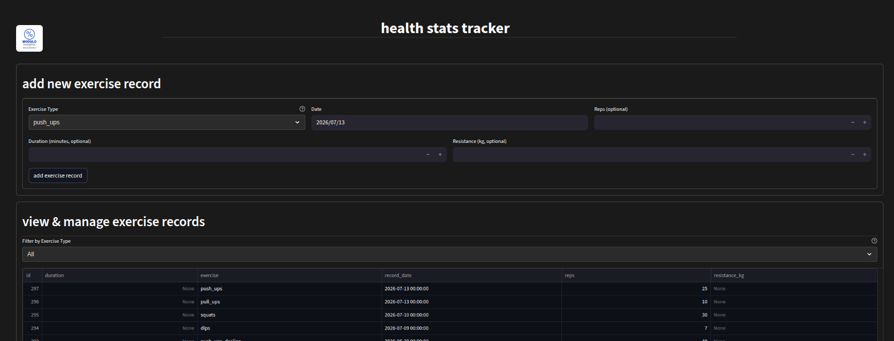

# Health Stats: Personal Health & Fitness Data Pipeline & Cloud Orchestration

Health Stats is an automated data platform that ingests, cleans, and consolidates full historical personal fitness data from my [Samsung Galaxy Watch](https://www.samsung.com/us/watches/) (examples include daily steps, sleep, and vitals), location data from mobile phone GPS logging, and workout details from a custom-built exercise logging API into a single database and visualizes the results for tracking and analysis. 

Originally built manually and running on a local Raspberry Pi cluster, this system was agentically migrated and optimized to run on the GCP Always Free Tier (using an e2-micro VM and serverless Cloud Run) for $0/month. It was developed as a practical application project in preparation for successfully certifying as a [Google Cloud Platform Professional Data Engineer](https://cloud.google.com/learn/certification/data-engineer).

*   **Looker Studio Dashboard**: [Health Stats - Public](https://datastudio.google.com/reporting/4d204527-a6ef-4860-b02c-73bf58cd1377)

---

## AI Collaboration Notice

I migrated, debugged, and optimized this cloud setup, built the personal health agent framework, and created the developer CLI skills in collaboration with an AI coding partner (**Cline** running **Claude 3.5 Sonnet**). Together, we worked through several real-world engineering constraints: diagnosing kernel Out-Of-Memory (OOM) crashes via GCP serial logs, refactoring the Python API layer, resolving SQLite database locks, designing a lightweight sequential execution pipeline, compiling views serverlessly with Dataform, and designing automated daily/weekly agentic schedules.

---

## Architecture & Data Flow

```
                                      [ Google Cloud Platform ]
                                      
  +----------------------+             +-------------------------------------------------+
  |  Google Cloud Run    |             |                 GCP e2-micro VM                 |
  |                      |             |                                                 |
  |  +----------------+  |  API POST   |  +-------------------+   +-------------------+  |
  |  |   Streamlit    |  |------------>|  |    Gunicorn APIs   |   |   Local MySQL     |  |
  |  |  Workout Entry |  | (Port 5001) |  |   (Ports 5000/5001)  |   | (Optimized RAM)   |  |
  |  +----------------+  |             |  +-------------------+   +---------^---------+  |
  |                      |             |                                   |
  |  (Scales to Zero!)   |             |  (Protected by a 2GB swap file)   |
  +----------------------+             +-------------------------------------------------+
```

1.  **Log Workouts**: I log my weight and strength workouts on a Streamlit web app. It is hosted on Google Cloud Run and scales down to zero instances when inactive to keep compute costs at $0.
2.  **API Layer**: The Streamlit app sends workout logs to a Flask API on port 5001 (served via Gunicorn on the VM), which writes them to MySQL.
3.  **Automatic Ingestion**: A background Prefect daemon runs on the VM to fetch raw sleep, steps, heart rate, and GPS logs directly from Google Drive and Cloud Storage.
4.  **Weather Enrichment**: The pipeline reverse-geocodes my GPS coordinates to find my location, queries the Visual Crossing Weather API for the conditions at that hour, and saves the enriched data to MySQL.
5.  **Data Warehouse Sync**: An automated hourly cron job on the VM runs a custom Python script (`mysql_to_bigquery.py`) to sync all tables from MySQL to BigQuery using the `WRITE_TRUNCATE` pattern.
6.  **Analytics**: Looker Studio connects directly to **BigQuery** (instead of hitting the transactional MySQL database) to populate interactive dashboards tracking my health and fitness trends over time with zero transactional overhead!
7.  **Dataform Transformation**: Google Cloud Dataform manages serverless SQL workflows in BigQuery, joining raw tables into optimized analytical views for downstream dashboarding and agent consumption.
8.  **Automated Health Agents**: Specialized agents run on top of the BigQuery warehouse, analyzing metrics to generate markdown reports and uploading daily and weekly summaries back to Google Drive.

---

## Scheduled Personal Health Agents 🤖

The pipeline runs four autonomous agents (orchestrated via Prefect) that process historical trends and real-time conditions to deliver personalized coaching insights:

*   **Weather AQI Guard** (`weather_aqi_guard.py`): Runs **daily at 7:30 AM**. Queries the upcoming weather and air quality index (AQI) forecasts to recommend the best daily activities (e.g., outdoor running vs. indoor strength training) along with clear scientific reasoning.
*   **Cardio Load Preventer** (`cardio_load_preventer.py`): Runs **daily at 8:00 AM**. Reviews recent cardiovascular workouts (running, cycling, swimming) to calculate training loads and warn if the acute-to-chronic workload ratio indicates high injury or overtraining risk.
*   **Sleep Recovery Optimizer** (`sleep_recovery_optimizer.py`): Runs **weekly on Saturdays at 8:30 AM**. Evaluates the past 7 days of sleep duration and sleep stage compositions (deep, light, REM, awake) to generate advanced sleep hygiene and recovery tips.
*   **Health Trend Analyst** (`health_trend_analyst.py`): Runs **weekly on Sundays at 8:00 AM**. Performs a holistic synthesis across steps, sleep, diet, and training trends to provide a high-level coaching review.

*Note: All agents write clear, action-oriented Markdown reports to the `/reports` directory and automatically upload them to Google Drive via an integrated uploader service (`gdrive_uploader.py`).*

---

## Developer CLI Skills 🌟

For developer operations, system monitoring, and rapid log entry, four interactive terminal skills are available:

1.  **Data Warehouse Sync & Verifier** (`python3 scripts/skills/sync_and_verify.py`): Forces a manual sync of all MySQL tables to BigQuery and compares row counts across 21 different tables, outputting a clear MATCH/MISMATCH diagnostic.
2.  **Historical Log Integrity & Gap Auditor** (`python3 scripts/skills/integrity_audit.py`): Scans the past 30 days of data in MySQL across core metrics (Sleep, Steps, Diet, GPS Locations, Blood Pressure) to identify and list any logging gaps.
3.  **Quick-Log Terminal Logger** (`python3 scripts/skills/quick_log.py`): Enables lightning-fast logging directly from the shell. Supports logging water (`water <ml_amount>`) and searching/logging food descriptions (`food "<query>" <grams>`) matched against a local USDA dataset.
4.  **Interactive Activity Planner** (`python3 scripts/skills/activity_planner.py`): Pulls 7-day activity suggestions and environmental planning scores from the compiled BigQuery Dataform views, outputting a color-coded upcoming schedule directly to the terminal.

---

## Tracker Workflow

The workout tracker is designed to be quick to use on a daily basis while still capturing structured data for downstream analytics.

1.  Start typing in the **Exercise Type** dropdown to filter the list in place. For example, typing `push` narrows the menu to push-up variations so it is easy to find the exact movement without scrolling through the full exercise catalog.

    

2.  Select the exercise, confirm the date, and enter the most relevant quantity for that movement. Rep-based exercises can be logged with **reps** and optional **resistance**, while time-based movements and stretches can be logged with **duration** instead.

    

3.  Submit the record and immediately verify it in the table at the bottom of the page. New entries show up in the tracker UI right away, are written into the `health_stats` database, and are then available for downstream syncing into BigQuery and dashboard analytics.

    

---

## BigQuery Table Schema Mapping

The following 21 tables are synchronized from the transactional MySQL database to the BigQuery Data Warehouse:

| MySQL Source Table | Target BigQuery Table | Sync Pattern | Data Domain / Description |
| :--- | :--- | :--- | :--- |
| `blood_pressure` | `health_stats.blood_pressure` | Overwrite | Daily blood pressure (systolic/diastolic) vitals |
| `cycling` | `health_stats.cycling` | Overwrite | High-frequency GPS & speed telemetry from cycling |
| `cycling_summary` | `health_stats.cycling_summary` | Overwrite | Aggregate metrics per cycling workout session |
| `diet` | `health_stats.diet_logs` | Overwrite | Daily food intake logs synced from Streamlit/MyFitnessPal |
| `exercises` | `health_stats.exercises` | Overwrite | Custom strength and cardio exercise definitions |
| `food_descriptions` | `health_stats.diet_food_descriptions_usda` | Overwrite | Calorie & macronutrient density data per food item |
| `food_ingredients` | `health_stats.diet_food_ingredients_usda` | Overwrite | Recipe ingredient mappings and custom logged meals |
| `heart_rate` | `health_stats.heart_rate` | Overwrite | Continuous second-by-second heart rate tracking |
| `locations` | `health_stats.locations` | Overwrite | Spatial latitude/longitude coordinates from watch GPS |
| `oxygen` | `health_stats.oxygen` | Overwrite | Blood oxygen saturation (SpO2) vitals tracking |
| `running` | `health_stats.running` | Overwrite | Granular running metrics and interval pace telemetry |
| `shootaround` | `health_stats.shootaround` | Overwrite | Basketball session times, active minutes, and logs |
| `sleep` | `health_stats.sleep` | Overwrite | Granular sleep stages (deep, light, REM, awake) |
| `steps` | `health_stats.steps` | Overwrite | Daily and hourly steps accumulated |
| `swimming` | `health_stats.swimming` | Overwrite | Ingested lap counts, stroke rates, and swim telemetry |
| `vo2max` | `health_stats.vo2max` | Overwrite | Cardiovascular fitness (VO2 Max) trends |
| `walking` | `health_stats.walking` | Overwrite | Step length, symmetry, and speed telemetry |
| `weather` | `health_stats.weather` | Overwrite | Weather conditions correlated hourly with location data |
| `weather_aqi` | `health_stats.weather_aqi` | Overwrite | Hourly Air Quality Index (AQI) values |
| `weather_forecast` | `health_stats.weather_forecast` | Overwrite | Daily weather & AQI forecast entries |
| `geocoded_locations` | `health_stats.geocoded_locations` | Overwrite | Reverse-geocoded physical address descriptors |

### Compiled Dataform Views (BigQuery)
A suite of serverless Dataform compilation scripts (`definitions/*.sqlx`) transforms these 21 tables into key analytical views, including:
*   `view_activity_recommendations`: Daily predictive fitness suggestions scoring weather, forecast rain, and AQI.
*   `view_sleep_summary`: Aggregated weekly sleep trends, sleep stages ratios, and night-by-night recovery.
*   `view_diet_recommendations`: Core daily macros and calorie intake matching fitness levels and workouts.
*   `view_scorecard_summary`: Consolidated daily vitals scorecard for dashboard header widgets.

---

## VM Constraints & Optimizations

Running a full database, orchestration server, and two APIs on a GCP `e2-micro` instance with only 1 GB of physical RAM required several critical performance tuning steps:

*   **Virtual Memory Protection**: We configured a permanent 2.0 GB swap file (`/swapfile`) on the VM's SSD, bringing total virtual memory to 3 GB. This prevents system freezes and Out-Of-Memory (OOM) crashes during database imports.
*   **Sequential Pipeline Execution**: To prevent CPU and disk I/O bottlenecks, we consolidated the 11 separate hourly ingestion pipelines into a single unified flow (`hs_hourly_etl`) that executes each task sequentially (one-by-one) instead of concurrently.
*   **Lock-Free Database Concurrency**: Prefect's local SQLite database (`prefect.db`) is configured to run in Write-Ahead Logging (WAL) Mode (`PRAGMA journal_mode=WAL;`). This allows concurrent read/write operations, completely eliminating `database is locked` errors during scheduled runs.
*   **Tuned MySQL 8.0**: Capped the InnoDB buffer pool to `64MB` (`innodb_buffer_pool_size=67108864`) to ensure the database operates comfortably alongside the Prefect server.
*   **Stable API Connections**: Refactored the core Flask API from `flask-mysqldb` to native `mysql-connector-python` to resolve worker crashes and guarantee compatibility with Flask 3.0+.
*   **Zero-Overhead BigQuery Sync**: Wrote a highly memory-efficient Python sync script (`scripts/mysql_to_bigquery.py`) that queries MySQL in chunks of 10,000 rows, streams them directly to local CSV files on the VM's disk, and uploads them using BigQuery's `load_table_from_file` stream. This caps RAM usage under 10MB (compared to >1.5GB of Pandas/PyArrow RAM spikes), eliminating disk thrashing or VM lockups during multi-million-row transfers.

---

## Project Structure

```
/
├── definitions/                      # Google Cloud Dataform SQLX pipeline view models
├── fitness_api/                      # Flask API served via Gunicorn (Port 5001)
├── fitness_streamlit_app/            # Workout Entry Portal deployed on GCP Cloud Run
├── gps_logger_app/                   # GPS logging API served via Gunicorn (Port 5000)
├── reports/                          # Local repository for generated health reports
├── scripts/
│   ├── mysql_to_bigquery.py          # Lightweight BigQuery synchronization script
│   ├── orchestrate.py                # Core Prefect sequential orchestration pipeline
│   ├── agents/                       # Specialized, scheduled personal health agents
│   ├── etl/                          # Python Extract-Transform-Load scripts
│   └── skills/                       # Developer interactive CLI scripts
├── vm_config/
│   ├── mysql/                        # Low-memory my.cnf limits
│   └── systemd/                      # Managed daemon systemd units (Prefect & APIs)
└── ARCHITECTURE_AND_MANAGEMENT.md    # Master sysadmin operations & troubleshooting playbook
```

---

## Recognition & Shoutouts

I want to give special recognition to the developers, communities, and organizations that made it possible to build and operate this platform at little to no cost.

*   **[Samsung Galaxy Watch](https://www.samsung.com/us/watches/)**: Captures the core health and activity data that powers this entire analytics platform.
*   **[Health Sync](https://healthsync.app/)**: Makes the whole pipeline possible by automating exports of my Samsung Watch data to Google Drive.
*   **[GPS Logger](https://gpslogger.app/)**: Provides reliable mobile GPS tracking data that feeds the location and weather enrichment workflows.
*   **[Visual Crossing Weather API](https://www.visualcrossing.com/weather-api/)**: Powers the weather enrichment layer so activities can be analyzed with environmental context.
*   **[Prefect Core](https://www.prefect.io/)**: Schedules and orchestrates both standard ETL data flows and scheduled personal health agent executions on a rock-solid foundation.
*   **[Google Cloud Dataform](https://cloud.google.com/dataform)**: Handles automated serverless SQL pipelines, joining and parsing raw data within BigQuery with zero hosting overhead.
*   **[Google Cloud Free Tier](https://cloud.google.com/free?hl=en)**: Made it realistic to host and operate this project in the cloud with a $0/month target.
*   **[Ubuntu Server](https://ubuntu.com/)**: Provides the stable operating system foundation for VM services and automation jobs.
*   **[Raspberry Pi](https://www.raspberrypi.com/)**: Served as the original platform where early versions of this pipeline were prototyped before cloud migration.
*   **[Google Cloud Professional Data Engineer Certificate](https://www.credly.com/badges/8efeb8f9-dd9e-46d2-b7c0-cc1ba975194e)**: A major learning milestone that directly influenced the architecture and engineering choices in this project.
*   **[Cline & Claude 3.5 Sonnet](https://github.com/gofireflyio/cline)**: Played the central developer role in migrating from the local Pi cluster to GCP, resolving lock contentions, designing the automated health agents, and writing developer-centric CLI skills.
